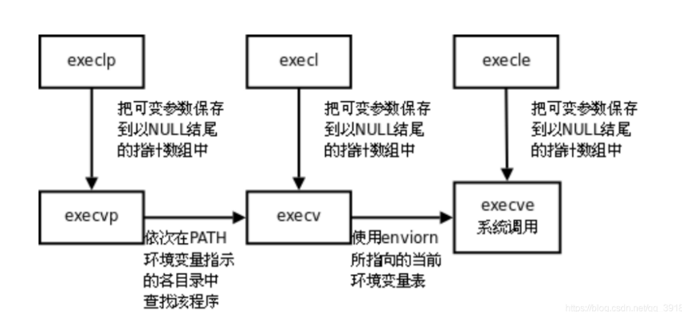
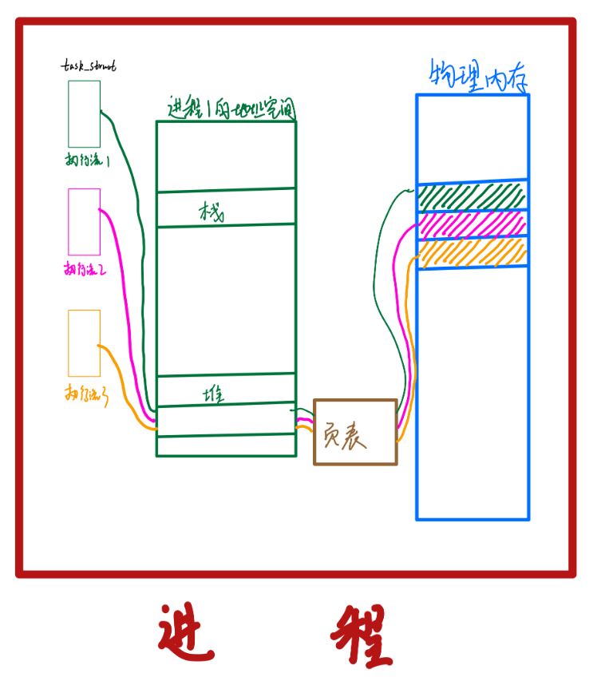

# 进程与线程

## 进程
### 进程相关概念
 - 并行和并发 
 - `PCB`：PCB - 进程控制块（Processing Control Block）
 - 进程状态
   ```c
   //linux源码定义进程状态如下
    static const char * const task_state_array[] = {
    "R (running)", /* 0 */   -运行或将要运行
    "S (sleeping)", /* 1 */  -进程在等待事件完成
    "D (disk sleep)", /* 2 */ -此状态进程通常等待IO结束
    "T (stopped)", /* 4 */   -停止状态
    "t (tracing stop)", /* 8 */ -追踪中
    "X (dead)", /* 16 */  -死亡状态
    "Z (zombie)", /* 32 */ -僵尸进程
    };
   ```
 - 进程优先级：CPU分配资源的先后顺序就是进程的优先级
   - `PRI`:代表这个进程执行的优先级，其值越小越早被执行
   - `NI`:代表这个进程的NICE值，用于修正进程优先级
 - 创建进程 - fork
    - 父进程使用`fork`创建子进程，返回值为子进程的`id`
    - 子进程调用`fork`,返回值为 `0`
 - 父子进程
    - 代码共享，数据私有
 - `exec`族函数
    - 通过一个进程启动另一个进程，这种情况下我们可以使用`exec`族函数
    
 - 进程控制
    - 结束进程：调用`exit(n)`函数，`n`即为进程结束后的返回值，`0`代表进程正常退出
    - 孤儿进程
      - 父进程先挂，子进程还继续运行，此时子进程会被1号进程领养，1号进程即为`systemd`
    - 僵尸进程
      - 子进程直接结束，没有告诉父进程自己挂了，所以子进程结束时一定要给父进程一个结束码
    - 进程回收
### 进程相关命令
```shell
 ps aux  #列出所有进程
	- a: 查看所有终端的信息
	- u: 查看用户相关的信息
	- x: 显示和终端无关的进程信息
 ps axj #查看父子进程关系
 ps aux | grep 文件名称/进程名字
 ps -l 列出当前用户创建的进程
```

## 线程
线程是轻量级的进程（LWP：light weight process），在 Linux 环境下线程的本质仍是进程。在计算机上运行的程序是一组指令及指令参数的组合，指令按照既定的逻辑控制计算机运行。操作系统会以进程为单位，分配系统资源，可以这样理解，**进程是资源分配的最小单位，线程是操作系统调度执行的最小单位**。

 - 进程有自己独立的地址空间，多个线程共用同一个地址空间
   - 线程更加节省系统资源，效率不仅可以保持的，而且能够更高
   - 在一个地址空间中多个线程独享：每个线程都有属于自己的栈区，寄存器 (内核中管理的)
   - 在一个地址空间中多个线程共享：代码段，堆区，全局数据区，打开的文件 (文件描述符表) 都是线程共享的
 - 线程是程序的最小执行单位，进程是操作系统中最小的资源分配单位
   - 每个进程对应一个虚拟地址空间，一个进程只能抢一个 CPU 时间片
一个地址空间中可以划分出多个线程，在有效的资源基础上，能够抢更多的 CPU 时间片   




### 多线程编程
 - **POSIX 线程库**   
 在Linux中是用进程模拟线程的，所以就不会用形如 `fork()` 这类的系统调用提供给我们用来专门控制线程。所以要实现多线程，就要使用到库函数，这里面比较底层的是`POSIX`线程库，所以它就是产生的就是用户级别的线程，其绝大多数函数名字都是以 `pthread_` 开头，并且注意引入头文件`<pthread.h>`，而且链接时注意加入 `-1pthread` 选项
 - **创建线程**      
   - `pthread`库中创建线程的函数是`pthread_create()`，该函数的声明如下：
     ```c
      int pthread_create(pthread_t *thread, const pthread_attr_t *attr, void *(*start_routine)(void*), void *arg);
     ```
     其中，`thread`参数是一个指向`pthread_t`类型的指针，用于返回新创建线程的`ID`。`attr`参数是一个指向`pthread_attr_t`类型的指针，用于指定线程的属性。如果不需要指定属性，则可以将该参数设置为`NULL`。`start_routine`参数是一个函数指针，用于指定新线程要执行的函数。该函数必须具有以下形式：
     ```c
     void* function_name(void *arg)
     ```
     其中，arg参数是一个指向线程参数的指针。函数执行完毕后，可以使用return语句返回结果，结果类型是void*类型。如果线程没有返回结果，则可以将该参数设置为NULL。
   - 需要注意的是，创建线程时可以指定线程属性，比如设置线程的栈大小、优先级等。可以使用`pthread_attr_init()`函数来初始化线程属性，然后使用`pthread_attr_setxxx()`函数来设置线程属性。线程属性设置完成后，可以将其传递给`pthread_create()`函数来创建线程。
 - **线程退出**      
   - 1.自然退出：当线程执行完它的任务或者调用了`pthread_exit()`函数，线程就会自然退出。在这种情况下，线程的所有资源都会被系统自动回收。    
   - 2.异常退出：当线程由于某种原因（如访问了非法地址、调用了非法指令等）导致崩溃时，线程就会异常退出。在这种情况下，线程的资源可能无法被完全回收，可能会导致内存泄漏等问题。     


 - **线程等待**
   - 线程等待指的是一个线程在等待其他线程执行完毕后再继续执行的过程。线程等待的主要目的是为了保证多个线程之间的同步性，避免线程之间的竞态条件和资源争用问题。
   - 在Linux系统中，线程等待通常使用`pthread_join()`函数来实现。该函数的作用是阻塞当前线程，等待指定的线程完成执行。当指定的线程完成后，`pthread_join()`函数会返回，并且将该线程的返回值传递给调用它的线程。同时，指定线程的资源也会被系统回收。
     ```c
     int pthread_join(pthread_t thread, void **retval);
     //其中，thread参数是要等待的线程的标识符，retval参数是指向存放线程返回值的指针。如果线程没有返回值，则该参数可以设置为NULL。
     ```
   - 需要注意的是，如果要使用`pthread_join()`函数等待一个线程，那么该线程必须是可连接的，即不能使用`pthread_detach()`函数将其分离。另外，如果要等待多个线程完成，可以在主线程中分别调用`pthread_join()`函数来等待每个线程的完成。   


 - **线程分离**
   - 线程分离指的是一个线程执行完它的任务后自动释放它所占用的资源，而不需要其他线程调用pthread_join()函数来等待它的退出。线程分离可以避免因线程没有被正确回收而导致的内存泄漏等问题，同时也可以提高程序的执行效率。
   - 在Linux系统中，线程分离通常使用`pthread_detach()`函数来实现。该函数的作用是将指定线程与它的父线程分离，使得该线程执行完它的任务后可以自动释放资源。同时，父线程也不需要调用`pthread_join()`函数来等待该线程的退出。
     ```c
     int pthread_detach(pthread_t thread);
     //其中，thread参数是要分离的线程的标识符。
     ```
   - 需要注意的是，一旦线程被分离，就不能再通过`pthread_join()`函数来等待它的退出。另外，如果一个线程已经处于分离状态，那么再次调用`pthread_detach()`函数或`pthread_join()`函数都会返回错误。因此，在使用`pthread_detach()`函数之前，需要确保该线程不再需要与其他线程进行同步和协作，并且也不需要其他线程等待它的退出。    


 - **线程回收**
   - 线程回收指的是释放一个线程所占用的系统资源，包括线程的栈空间、线程描述符等。线程回收通常发生在一个线程执行完它的任务后，或者在另外一个线程等待它的退出时。
   - 在Linux系统中，线程回收可以通过`pthread_join()`函数来实现。该函数的作用是等待指定的线程退出，并且将线程占用的资源回收。如果一个线程已经被分离，那么系统会自动回收该线程的资源，不需要调用`pthread_join()`函数。
     ```c
     int pthread_join(pthread_t thread, void **retval);
     ```
     `thread`参数是要等待的线程的标识符，`retval`参数是指向存放线程返回值的指针。
     如果线程没有返回值，则该参数可以设置为`NULL`

 - **线程取消**    
   - 线程取消指的是强制终止一个正在运行的线程。线程取消可以通过调用`pthread_cancel()`函数来实现。线程取消是在多线程编程中比较常用的一种技术，可以用来结束那些执行时间过长或者已经失去响应的线程，避免它们继续占用系统资源。 
     ```c
     int pthread_cancel(pthread_t thread);
     ```
     `thread`参数是要取消的线程的标识符。
   - 需要注意的是，线程取消是一种强制终止线程的方式，会导致线程无法正常结束。因此，如果要使用线程取消，需要在编写程序时特别小心，避免出现线程资源泄漏等问题。在实际编程中，通常会在要取消的线程中设置取消点，当线程被取消时，在取消点处执行清理工作，以确保线程的资源被正确释放。
   - 在Linux系统中，线程取消有两种方式：异步取消和推迟取消。异步取消是指直接终止线程的执行，没有机会执行清理工作。推迟取消是指在线程中设置取消点，等到线程执行到取消点时再执行清理工作。默认情况下，Linux系统使用推迟取消方式来取消线程，可以通过`pthread_setcanceltype()`函数来设置线程取消的方式。
     ```c
     int pthread_setcanceltype(int type, int *oldtype);
     ```
     其中，`type`参数指定线程取消的方式，可以取值为`PTHREAD_CANCEL_ASYNCHRONOUS`（异步取消）和`PTHREAD_CANCEL_DEFERRED`（推迟取消）。`oldtype`参数用于返回之前的取消方式。
   - 需要注意的是，如果要使用线程取消，需要特别小心，避免出现线程资源泄漏等问题。在实际编程中，通常会在要取消的线程中设置取消点，当线程被取消时，在取消点处执行清理工作，以确保线程的资源被正确释放。同时，还需要确保在多线程环境下，线程之间的同步和协作能够正确地进行。

 - **线程同步**   
   - 线程同步指的是控制多个线程之间的执行顺序和访问共享资源的方式，以保证线程之间的正确性和一致性。在并发编程中，线程同步是非常必要的，因为多个线程可能会同时访问同一个共享资源，导致数据不一致或者竞态条件的问题。 
   - 常见的线程同步方法包括**锁**、**信号量**、**条件变量**等。锁是一种最常用的同步机制，它可以确保在任何时刻只有一个线程能够访问共享资源，从而避免了竞态条件的问题。信号量是一种更加通用的同步机制，它可以用来控制多个线程对共享资源的访问次数。条件变量则是一种用于线程间通信的同步机制，它可以使线程在满足特定条件时等待或唤醒。
 
  